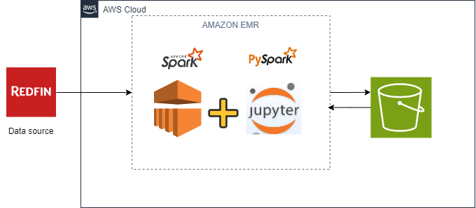

# Redfin Real Estate Data Analysis with PySpark

This project demonstrates how to perform data analysis on real estate data using PySpark. The dataset is sourced from Redfin, a popular real estate brokerage, and contains various features related to property listings. The analysis involves data cleaning, transformation, and extracting meaningful insights using PySpark.

## Project Overview

In this project, I set up a PySpark environment to analyze real estate data from Redfin. The analysis includes comprehensive data cleaning, transformation, and visualization to uncover insights about property listings, pricing trends, and market dynamics. The project demonstrates my ability to handle large datasets and perform advanced data analytics using PySpark.


## Architecture Overview

The image below illustrates the architecture used in this project. Real estate data sourced from Redfin is processed using PySpark and Jupyter Notebook within an Amazon EMR cluster on AWS. This setup allows for scalable data processing and analysis. The processed data is then stored in an Amazon S3 bucket for further use and analysis. This integration of AWS services ensures efficient handling of large datasets and seamless data flow from source to storage.



## Features

- **Data Cleaning:** Removal of duplicates, handling missing values, and transforming data types to ensure the dataset is ready for analysis.
- **Data Transformation:** Aggregating and summarizing the data to extract key insights, such as average pricing trends and property features.
- **Exploratory Data Analysis:** Exploring relationships between different features in the dataset to understand market trends and make data-driven decisions.

## Getting Started

### Prerequisites

- Python 3.x
- PySpark
- Jupyter Notebook or any Python IDE

### Installation

1. Clone the repository:
   ```bash
   git clone https://github.com/aouadayoub/redfin-spark-analytics.git
   cd redfin-spark-analytics
   ```

2. Install the required Python packages:
   ```bash
   pip install -r requirements.txt
   ```

3. Launch the Jupyter Notebook (if using):
   ```bash
   jupyter notebook
   ```

### Running the Analysis

1. Open the `redfin-analytics-workspace1.ipynb` notebook.
2. Follow the cells to load the data, perform cleaning, transformation, and analysis.
3. Review the outputs and visualizations to gain insights from the data.

## Data

The data used in this project is sourced from Redfin's publicly available real estate listings. It includes a wide range of features, such as:

- **Time Period:**
  - `period_begin`, `period_end`, `period_duration`

- **Region Information:**
  - `region_type`, `region_type_id`, `region`, `city`, `state`, `state_code`, `parent_metro_region`, `parent_metro_region_metro_code`

- **Property Information:**
  - `property_type`, `property_type_id`

- **Pricing Data:**
  - `median_sale_price`, `median_sale_price_mom`, `median_sale_price_yoy`
  - `median_list_price`, `median_list_price_mom`, `median_list_price_yoy`
  - `median_ppsf`, `median_ppsf_mom`, `median_ppsf_yoy`
  - `median_list_ppsf`, `median_list_ppsf_mom`, `median_list_ppsf_yoy`

- **Sales and Listings Data:**
  - `homes_sold`, `homes_sold_mom`, `homes_sold_yoy`
  - `pending_sales`, `pending_sales_mom`, `pending_sales_yoy`
  - `new_listings`, `new_listings_mom`, `new_listings_yoy`

- **Market Supply and Demand:**
  - `inventory`, `inventory_mom`, `inventory_yoy`
  - `months_of_supply`, `months_of_supply_mom`, `months_of_supply_yoy`
  - `median_dom`, `median_dom_mom`, `median_dom_yoy`

- **Market Conditions:**
  - `avg_sale_to_list`, `avg_sale_to_list_mom`, `avg_sale_to_list_yoy`
  - `sold_above_list`, `sold_above_list_mom`, `sold_above_list_yoy`
  - `price_drops`, `price_drops_mom`, `price_drops_yoy`
  - `off_market_in_two_weeks`, `off_market_in_two_weeks_mom`, `off_market_in_two_weeks_yoy`

- **Other Information:**
  - `is_seasonally_adjusted`, `table_id`, `last_updated`


## Results

The analysis in this project provides insights into:

- Average listing prices by property type and location.
- Market trends based on historical listing data.
- Correlations between different property features, such as the relationship between square footage and listing price.

## License

This project is licensed under the MIT License.

## Acknowledgments

- Thanks to [Redfin](https://www.redfin.com/) for providing the data.

